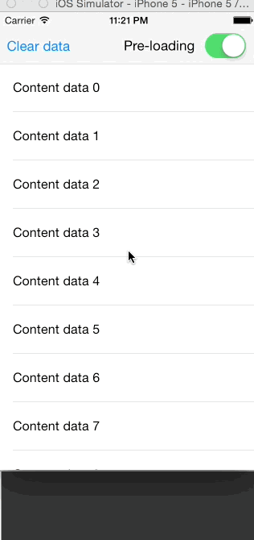

# PagedArray
[](http://cocoadocs.org/docsets/PagedArray)
[](http://cocoadocs.org/docsets/PagedArray)
[](http://cocoadocs.org/docsets/PagedArray)

PagedArray is a generic Swift data structure for helping you implement paging mechanisms in (but not limited to) UITableViews, UICollectionViews and UIPageViewControllers.

It is a Swift-version of its Objective-C equivalent [`AWPagedArray`](https://github.com/MrAlek/AWPagedArray), which was used for implementing the techniques described in the blog post [Fluent Pagination – no more jumpy scrolling](http://www.iosnomad.com/blog/2014/4/21/fluent-pagination).

PagedArray represents a list of optional elements stored by pages. It implements all the familiar Swift collection protocols so your datasource can use it just like a regular Array while providing an easy-to-use API for setting pages of data as they are retrieved.

```swift

// Initialize
var pagedArray = PagedArray<String>(count: 200, pageSize: 20)

// Set data pages
pagedArray.set(elements: ["A" ... "T"], forPage: 1)

// Retrieve data like a normal array containing optional elements
pagedArray.count // 200
pagedArray[0] // "A"
pagedArray[100] // nil

// Iterate
for element: String? in pagedArray {
    // Do magic
}

// Map, filter reduce
pagedArray.filter{ $0 != nil }.map{ $0! }.reduce("", combine:+) // "ABCDE..."

// Convert to array
Array(pagedArray) // ["A", "B", ... nil, nil]

```



## Requirements

PagedArray is currently built for Swift 3.0 using Xcode 8

## Installation

**Embedded frameworks require a minimum deployment target of iOS 8 or OS X Mavericks.**

To use PagedArray with a project targeting iOS 7, you must include the `PagedArray.swift` source file directly in your project.

### Cocoapods

To integrate PagedArray into your Xcode project using CocoaPods, specify it in your `Podfile`:

```ruby
source 'https://github.com/CocoaPods/Specs.git'
platform :ios, '8.0'

pod 'PagedArray', '~> 0.5'
```

Then, run the following command:

```bash
$ pod install
```

### Carthage

Carthage is a decentralized dependency manager that automates the process of adding frameworks to your Cocoa application.

You can install Carthage with [Homebrew](http://brew.sh/) using the following command:

```bash
$ brew update
$ brew install carthage
```

To integrate PagedArray into your Xcode project using Carthage, specify it in your `Cartfile`:

```ogdl
github "MrAlek/PagedArray" >= 0.5
```

## Demo

The included example project shows a demo with a tweakable `UITableViewController` displaying a large number of rows using paging data.

## Tests

The data structure is thoroughly tested by included XCUnit tests but no guarantees are given.

## License

PagedArray is available under the MIT license. See the LICENSE file for more info.
